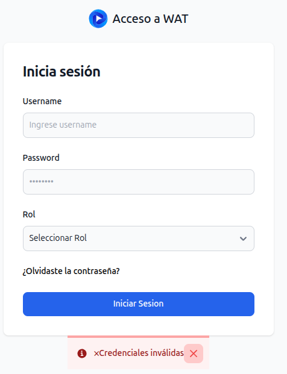

# Alertas

[https://flowbite.com/docs/components/alerts/](https://flowbite.com/docs/components/alerts/)

Genera alertas basadas en esos componentes.

Tipos de alerta

```java
public enum AlertType {
    INFO,DANGER, SUCCESS,WARNING,SIMPLE
}
```

Declaración de Alerta

```java

 Alert alert = null;
       
            alert = new Alert(
                    "❌Credenciales inválidas",
                    AlertType.DANGER,
                    true
            );
      

```

Añadir a un componente superior

```java

Form form = new Form()
            .add(alert);

```


## Formularios de ejemplo

* LoginController.java


